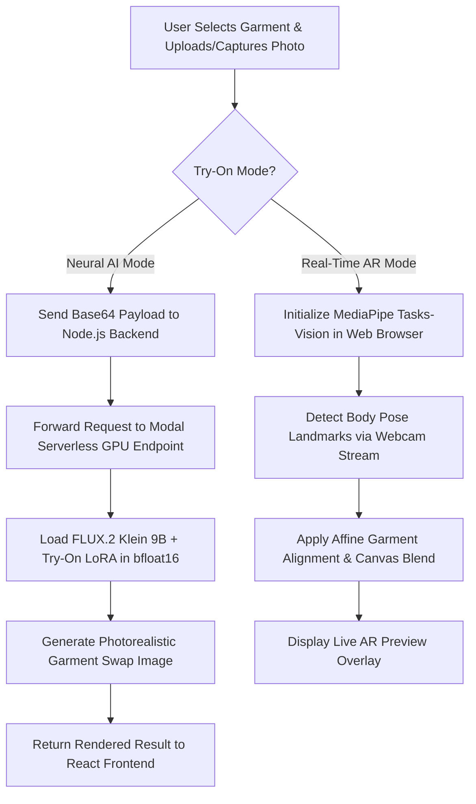

# 🛍️ Fitsy – Virtual Try-On AR & AI Fashion Shopping Platform

[](https://nodejs.org/)
[](https://react.dev/)
[](https://vitejs.dev/)
[](https://expressjs.com/)
[](https://www.mongodb.com/)
[](https://pytorch.org/)
[](https://modal.com/)
[](https://stripe.com/)

**Fitsy** is a full-stack, AI-powered Virtual Try-On (VTON) & Augmented Reality (AR) fashion shopping application. It bridges the gap between online fashion retail and real-world fitting rooms by allowing users to virtually try on clothing, footwear, makeup, and accessories in real-time or via generative AI, reducing online return rates and boosting buyer confidence.

---

## 📑 Table of Contents

- [Key Features](#-key-features)
- [System Architecture](#-system-architecture)
- [Virtual Try-On (VTON) Pipeline](#-virtual-try-on-vton-pipeline)
- [Technology Stack](#-technology-stack)
- [Project Directory Structure](#-project-directory-structure)
- [Requirements & Dependencies](#-requirements--dependencies)
- [Installation & Setup Guide](#-installation--setup-guide)
  - [1. Prerequisites](#1-prerequisites)
  - [2. Backend Setup](#2-backend-setup)
  - [3. Frontend Setup](#3-frontend-setup)
  - [4. Neural VTON Microservice (Modal Labs)](#4-neural-vton-microservice-modal-labs)
- [Environment Variables Configuration](#-environment-variables-configuration)
- [Database Models & Seeding](#-database-models--seeding)
- [API Endpoints Reference](#-api-endpoints-reference)
- [Academic Project Milestones (7-Week Report)](#-academic-project-milestones-7-week-report)
- [License](#-license)

---

## ✨ Key Features

### 👗 1. Dual Virtual Try-On (VTON) Engine
* **Neural AI Try-On (Serverless GPU)**: Deploys the state-of-the-art **FLUX.2 Klein 9B** diffusion model paired with a custom Virtual Try-On LoRA (`fal/flux-klein-9b-virtual-tryon-lora`) on Modal Labs (`L40S` 48GB GPU). Produces hyper-realistic body-garment composite images.
* **Client-Side AR Camera Overlay**: Integrates `@mediapipe/tasks-vision` pose landmark detection for live webcam try-ons. Computes real-time affine warping to place garments, glasses, shoes, and jewelry over body landmarks.

### 🛍️ 2. Comprehensive E-Commerce Experience
* **Dynamic Catalog & Search**: Instant filtering by category (*Clothes, Shoes, Glasses, Jewelry, Makeup*), price range slider, star rating filter, and keyword search.
* **Interactive Product Details**: Custom garment adjustment controls allowing users to adjust stretch, height ratio, widen factors, and vertical alignment before trying on or adding to cart.
* **Shopping Cart & Wishlist**: Real-time state management for item additions, quantity modifications, price calculations, and persistent user wishlist sync.

### 🔑 3. Authentication & User Management
* **JWT Cookie Authentication**: Secure JSON Web Token auth using HTTP-Only cookies.
* **Password Hashing**: Industry-standard password encryption using `bcryptjs`.
* **User Dashboard & Order History**: User profile page displaying order status history, shipping details, and saved items.

### 💳 4. Payments & Order Fulfillment
* **Stripe Checkout Integration**: Client-side Stripe Payment Element integration for credit card processing.
* **Secure Webhook Verification**: Express raw request processing to verify Stripe webhook signatures (`/api/webhook/stripe`) and automatically mark orders as paid.
* **Email Notifications**: Automated transactional emails using `nodemailer` for order confirmation receipts.

### 📊 5. Admin Dashboard
* Inventory control, product creation/editing, catalog management, and order status fulfillment panel (`Pending`, `Processing`, `Shipped`, `Delivered`).

### 🤖 6. AI Personal Stylist
* **Natural-language outfit requests** (e.g. *"I'm going to a college farewell. I want something stylish and mostly black, under $60."*) parsed into occasion/style/color/budget hints, with optional structured fields for the same inputs.
* **Grounded recommendations only**: candidate products are retrieved from the real catalog (MongoDB, or the in-memory fallback) *before* the AI ever sees them, and every product the AI returns is re-validated against that exact candidate set — the AI can never introduce a product, price, or id that doesn't exist in the store.
* **Powered by Groq** (Llama 3.3 70B, JSON mode) via a plain server-side `fetch` call — no client-exposed keys, no new AI SDK dependency.
* Outfit results plug straight into the existing **cart**, **wishlist**, and **virtual try-on** flows — no parallel systems.

### 📏 7. AI Size Recommendation
* **Deterministic measurement matching, not a guess**: given a shopper's chest/waist/hip measurements, the backend compares them directly against the *selected product's own* size chart — every recommendation is driven by real per-product data stored on the product, never a universal S/M/L table.
* **AI never picks the size.** The matching algorithm (`sizeRecommendationService.js`) is a pure, testable function with zero AI calls. Groq is used *only* to rephrase an already-computed result into a warmer sentence — if the AI call fails, the deterministic explanation is used instead and the recommendation itself is unaffected.
* Supports **letter-sized** apparel (chest/waist/hip range charts, cm) and **numeric-waist** items like jeans (direct waist-measurement matching, e.g. a 71cm waist → size "28").
* **Fit Preference** (Slim / Regular / Relaxed / Oversized) nudges which part of a valid range is treated as ideal — it can shift *which* real size is favored near a boundary, but can never invent a size the chart doesn't have.
* Honest by design: confidence is reported as **High / Medium / Low** based on actual match quality (never a fabricated percentage), and products without chart data return a clear "no size chart available" message instead of a fake answer.
* Optional **My Fit Profile**: logged-in users can save their measurements once and reuse them across products via "Use My Saved Measurements."
* Selecting a recommended size populates the **existing** product-page size selector — "Add to Cart" is untouched.

---

## 🏗️ System Architecture

```
                                  ┌────────────────────────┐
                                  │   React 18 + Vite UI   │
                                  │ (Frontend Port 5173)   │
                                  └───────────┬────────────┘
                                              │
                                HTTP REST / Cookie Auth
                                              │
                                              ▼
                                ┌──────────────────────────┐
                                │   Express 5 Node.js API  │
                                │  (Backend Port 5001)     │
                                └──────┬────────────┬──────┘
                                       │            │
             ┌─────────────────────────┘            └─────────────────────────┐
             ▼                                                                ▼
   ┌──────────────────┐                                             ┌──────────────────┐
   │ MongoDB Database │                                             │ Modal Serverless │
   │   (Mongoose 9)   │                                             │    Python GPU    │
   └──────────────────┘                                             │ (FLUX.2 Klein 9B)│
                                                                    └──────────────────┘
```

---

## 🔄 Virtual Try-On (VTON) Pipeline



---

## 🛠️ Technology Stack

| Domain | Technology / Library | Description |
| :--- | :--- | :--- |
| **Frontend Framework** | React 18, Vite 5 | Fast component-based UI rendering and module bundling |
| **Routing & Icons** | React Router DOM v6, Lucide React | Single-page app routing and clean vector icon set |
| **AR & Vision (Client)** | `@mediapipe/tasks-vision` | Browser-side body landmark & pose estimation |
| **Styling** | Vanilla CSS (Glassmorphism) | Custom CSS design tokens, responsive grid, animations |
| **Backend Framework** | Node.js, Express 5.2 | RESTful API backend microservice |
| **Database & ODM** | MongoDB, Mongoose 9.9 | NoSQL document storage for users, products, orders, cart |
| **Auth & Security** | JWT, Cookie-Parser, BcryptJS | Token authentication & encrypted password storage |
| **Payments** | Stripe Node SDK, `@stripe/stripe-js` | Payment processing and raw webhook validation |
| **Email Service** | Nodemailer | Transactional email generation |
| **AI / GPU Microservice** | Modal Labs, Python 3.11 | Serverless cloud GPU deployment (NVIDIA L40S) |
| **Generative AI Models** | FLUX.2 Klein 9B + Try-On LoRA | High-speed diffusion inference pipeline |
| **Local Segmentation** | Python 3.10+, MediaPipe, OpenCV, PIL | Server-side pose segmentation utilities |

---

## 📁 Project Directory Structure

```
fitsy/
├── backend/
│   ├── config/              # Database connection setup (db.js)
│   ├── controllers/         # API controllers (auth, cart, order, product, tryOn, webhook)
│   ├── middleware/          # JWT auth middleware (authMiddleware.js)
│   ├── models/              # Mongoose schemas (User, Product, Cart, Order, Wishlist)
│   ├── routes/              # Express API routes
│   ├── services/            # Microservice connectors (modalVtonService, samService, vtonService)
│   ├── utils/               # Helper utilities & Python pose segmenter
│   │   ├── modal_vton_app.py
│   │   ├── requirements.txt # Python requirements for SAM segmenter
│   │   ├── samSegmenter.py
│   │   └── sendEmail.js
│   ├── .env.example         # Backend environment variable template
│   ├── index.js             # Express server entry point
│   ├── package.json         # Node.js backend dependencies
│   └── seed.js              # Database catalog seeder script
├── frontend/
│   ├── src/
│   │   ├── components/      # UI components (AROverlay, GarmentTryOn, Navbar, Footer, etc.)
│   │   ├── context/         # React Context state (AuthContext, CartContext)
│   │   ├── data/            # Static fallback product catalog
│   │   ├── pages/           # Page views (Home, Catalog, ProductPage, Checkout, Account, Admin)
│   │   ├── services/        # API service clients
│   │   ├── index.css        # Core design tokens, dark mode, animations
│   │   └── App.jsx          # React app shell & routing configuration
│   ├── index.html           # HTML template
│   ├── package.json         # React frontend dependencies
│   ├── project_report.html  # 7-Week Academic Progress Report
│   └── vite.config.js       # Vite build configuration
├── vton-modal/
│   ├── app.py               # Modal Labs serverless app (FLUX.2 Klein 9B + Try-On LoRA)
│   ├── requirements.txt     # Python requirements for Modal GPU service
│   └── test_vol.py          # Modal volume test script
├── requirements.txt         # Consolidated Python requirements file for entire project
└── README.md                # Full project documentation
```

---

## 📦 Requirements & Dependencies

### 1. Node.js Backend (`backend/package.json`)
```json
"dependencies": {
  "bcryptjs": "^3.0.3",
  "cookie-parser": "^1.4.7",
  "cors": "^2.8.6",
  "dotenv": "^17.4.2",
  "express": "^5.2.1",
  "jsonwebtoken": "^9.0.3",
  "mongoose": "^9.9.1",
  "nodemailer": "^9.0.4",
  "stripe": "^22.4.0"
}
```

### 2. React Frontend (`frontend/package.json`)
```json
"dependencies": {
  "@mediapipe/tasks-vision": "^0.10.34",
  "@stripe/react-stripe-js": "^6.8.0",
  "@stripe/stripe-js": "^9.13.0",
  "lucide-react": "^0.363.0",
  "react": "^18.2.0",
  "react-dom": "^18.2.0",
  "react-router-dom": "^6.22.3"
}
```

### 3. Python AI Microservices (`requirements.txt`)
```txt
modal>=0.64.0
torch>=2.5.0
torchvision>=0.20.0
transformers>=4.53.0
accelerate>=0.30.0
safetensors>=0.4.0
pillow>=10.0.0
numpy>=1.24.0,<2.0
huggingface_hub>=0.25.0
fastapi[standard]
pydantic>=2.0
peft>=0.11.0
mediapipe==0.10.14
git+https://github.com/huggingface/diffusers.git
```

---

## ⚙️ Installation & Setup Guide

### 1. Prerequisites
Ensure you have the following installed on your machine:
* **Node.js**: v18.0.0 or higher
* **npm**: v9.0.0 or higher
* **MongoDB**: Local MongoDB community server running on port `27017` or MongoDB Atlas URI
* **Python**: 3.10 – 3.11 (for Modal CLI / local segmentation)
* **Modal Account**: Optional, required only for serverless GPU Neural VTON features ([modal.com](https://modal.com))

---

### 2. Backend Setup

1. Open a terminal and navigate to the backend directory:
   ```bash
   cd fitsy/backend
   ```

2. Install Node.js dependencies:
   ```bash
   npm install
   ```

3. Create your `.env` file by copying `.env.example`:
   ```bash
   cp .env.example .env
   ```

4. Configure your `.env` variables (MongoDB URI, JWT Secret, Stripe Keys, Gmail SMTP):
   ```env
   PORT=5001
   MONGO_URI=mongodb://127.0.0.1:27017/fitsy
   JWT_SECRET=supersecretjwtkey_replace_in_production
   EMAIL_USER=your_email@gmail.com
   EMAIL_PASS=your_app_password
   STRIPE_SECRET_KEY=sk_test_...
   STRIPE_WEBHOOK_SECRET=whsec_...
   MODAL_VTON_URL=https://<your-modal-app>.modal.run/generate
   GROQ_API_KEY=gsk_...
   ```
   `GROQ_API_KEY` powers the **AI Personal Stylist** (`/api/stylist/recommend`). Get a free key at [console.groq.com/keys](https://console.groq.com/keys). If left empty, the stylist endpoint responds with a clear "AI stylist unavailable" error instead of the rest of the app breaking.

5. Seed the database with sample catalog products:
   ```bash
   node seed.js
   ```

6. Start the backend development server:
   ```bash
   npm run dev
   ```
   *The server will start at `http://localhost:5001`.*

---

### 3. Frontend Setup

1. Open a new terminal tab and navigate to the frontend directory:
   ```bash
   cd fitsy/frontend
   ```

2. Install dependencies:
   ```bash
   npm install
   ```

3. Create your `.env` file from `.env.example`:
   ```bash
   cp .env.example .env
   ```

4. Configure your `.env` file:
   ```env
   VITE_API_URL=http://localhost:5001/api
   VITE_STRIPE_PUBLIC_KEY=pk_test_...
   ```

5. Start the Vite frontend development server:
   ```bash
   npm run dev
   ```
   *The frontend will start at `http://localhost:5173`.*

---

### 4. Neural VTON Microservice (Modal Labs)

If you want to enable pure serverless AI try-on generation using FLUX.2:

1. Install Python Modal CLI:
   ```bash
   pip install modal
   ```

2. Authenticate with Modal:
   ```bash
   modal setup
   ```

3. Setup your HuggingFace Secret in Modal (required to download FLUX model weights):
   ```bash
   modal secret create huggingface HF_TOKEN=hf_...
   ```

4. Deploy the microservice to Modal:
   ```bash
   modal deploy fitsy/vton-modal/app.py
   ```

5. Copy the deployed ASGI URL provided by Modal (e.g. `https://username--fitsy-vton-asgi-app.modal.run/generate`) and paste it into your `backend/.env` under `MODAL_VTON_URL`.

---

## 📡 API Endpoints Reference

### 🔐 Authentication (`/api/auth`)
| Method | Endpoint | Description | Access |
| :--- | :--- | :--- | :--- |
| `POST` | `/api/auth/register` | Register a new user | Public |
| `POST` | `/api/auth/login` | Login user & return HTTP-only auth token | Public |
| `POST` | `/api/auth/logout` | Logout user & clear cookie | Public |
| `GET` | `/api/auth/me` | Fetch authenticated user profile | Private |
| `PUT` | `/api/auth/profile` | Update profile information | Private |

### 🛍️ Products (`/api/products`)
| Method | Endpoint | Description | Access |
| :--- | :--- | :--- | :--- |
| `GET` | `/api/products` | Get all catalog products with search & category filters | Public |
| `GET` | `/api/products/:id` | Get single product details by ID | Public |
| `POST` | `/api/products` | Create a new product | Admin |
| `PUT` | `/api/products/:id` | Update product details | Admin |
| `DELETE`| `/api/products/:id` | Delete product | Admin |

### 🛒 Shopping Cart (`/api/cart`)
| Method | Endpoint | Description | Access |
| :--- | :--- | :--- | :--- |
| `GET` | `/api/cart` | Get current user's shopping cart | Private |
| `POST` | `/api/cart/add` | Add item to cart | Private |
| `PUT` | `/api/cart/update` | Update item quantity in cart | Private |
| `DELETE`| `/api/cart/remove/:itemId` | Remove item from cart | Private |
| `DELETE`| `/api/cart/clear` | Clear entire cart | Private |

### 💖 Wishlist (`/api/wishlist`)
| Method | Endpoint | Description | Access |
| :--- | :--- | :--- | :--- |
| `GET` | `/api/wishlist` | Get user's saved wishlist items | Private |
| `POST` | `/api/wishlist/toggle` | Add/Remove product from wishlist | Private |

### 💳 Orders & Payments (`/api/orders`)
| Method | Endpoint | Description | Access |
| :--- | :--- | :--- | :--- |
| `POST` | `/api/orders/create-payment-intent` | Create Stripe PaymentIntent client secret | Private |
| `POST` | `/api/orders` | Create order record after payment authorization | Private |
| `GET` | `/api/orders/my-orders` | Fetch logged-in user's order history | Private |
| `GET` | `/api/orders/:id` | Get specific order detail | Private |
| `PUT` | `/api/orders/:id/status` | Update order shipping/fulfillment status | Admin |

### 🎭 Virtual Try-On (`/api/tryon`)
| Method | Endpoint | Description | Access |
| :--- | :--- | :--- | :--- |
| `POST` | `/api/tryon/estimate-body` | Run MediaPipe/SAM body pose landmarking | Public |
| `POST` | `/api/tryon/process-tryon` | Compute backend garment warp composite | Public |
| `POST` | `/api/tryon/generate` | Trigger FLUX.2 Serverless Neural VTON GPU inference | Public |

### 🤖 AI Stylist (`/api/stylist`)
| Method | Endpoint | Description | Access |
| :--- | :--- | :--- | :--- |
| `POST` | `/api/stylist/recommend` | Generate an AI outfit recommendation from real catalog products | Public |

**Request body:**
```json
{
  "prompt": "I'm going to a college farewell. I want something stylish and mostly black, under $60.",
  "occasion": "College",
  "style": "Casual",
  "budget": 60,
  "color": "black"
}
```
`prompt` is required (max 400 characters); `occasion`, `style`, `budget`, and `color` are optional and refine candidate selection alongside whatever the AI infers from `prompt` itself.

**Response body:**
```json
{
  "success": true,
  "data": {
    "outfitName": "Smart Black Casual",
    "reason": "Since you mentioned a college farewell and a mostly black style, I kept it smart-casual while staying in budget.",
    "items": [
      { "productId": "64f...", "name": "Black Oversized Shirt", "price": 45, "image": "...", "category": "Tops", "reason": "Grounds the look in black without feeling formal." }
    ],
    "totalPrice": 143,
    "overBudget": false,
    "insufficientCatalog": false
  }
}
```
On failure (`success: false`), `message` explains what went wrong (invalid input, empty catalog, AI unavailable, AI rate-limited, or no matching products) — the frontend renders each of these as a distinct state rather than a raw error.

### 📏 Size Recommendation (`/api/size-recommendation`)
| Method | Endpoint | Description | Access |
| :--- | :--- | :--- | :--- |
| `POST` | `/api/size-recommendation` | Recommend a size from real measurements + the product's real size chart | Public |
| `PUT` | `/api/auth/fit-profile` | Save the logged-in user's measurements for reuse across products | Private |

**Request body:**
```json
{
  "productId": "64f...",
  "measurements": { "height": 178, "weight": 72, "chest": 96, "waist": 81, "hip": 96 },
  "fitPreference": "regular"
}
```
`productId` and `measurements` are required (at least one of chest/waist/hip). `fitPreference` is one of `slim | regular | relaxed | oversized`, defaults to `regular`.

**Response body (successful match):**
```json
{
  "success": true,
  "data": {
    "status": "ok",
    "recommendedSize": "M",
    "confidence": "high",
    "alternative": null,
    "reason": "Your chest and waist measurements fall within the M size range for this product.",
    "measurementBreakdown": {
      "chest": { "user": 96, "min": 90, "max": 98, "match": true },
      "waist": { "user": 81, "min": 74, "max": 82, "match": true }
    }
  }
}
```
Other `data.status` values: `no_chart` (product has no measurement data yet) and `no_match` (measurements fall outside every available size). `success: false` responses cover invalid input (e.g. an unrealistic or non-numeric measurement) and unknown products.

**Limitations:** this feature estimates a likely size from self-reported measurements and each product's stored size chart — it is not a body scan, does not use a camera, and is not a guaranteed or perfect fit. Size chart data for the demo catalog is standard ready-to-wear reference data, not manufacturer-verified per garment. Always treat the result as a starting recommendation, same as any online size guide.

### ⚡ Webhooks (`/api/webhook`)
| Method | Endpoint | Description | Access |
| :--- | :--- | :--- | :--- |
| `POST` | `/api/webhook/stripe` | Handle raw Stripe webhook events (`payment_intent.succeeded`) | Public (Stripe Signature) |

---

## 📊 Academic Project Milestones (7-Week Report)

Below is the weekly milestone summary tracked in the academic project report (`frontend/project_report.html`):

| Week | Focus Area | Key Deliverables & Outcomes | Status |
| :---: | :--- | :--- | :---: |
| **Week 1** | Requirements & Planning | Finalized project scope ("Fitsy"), target audience, low-fidelity wireframes, and category breakdown (Clothes, Shoes, Glasses, Jewelry, Makeup). | `Completed` |
| **Week 2** | Page Structure & Layout | Built HTML page skeletons for Home, Catalog, and Product detail views using semantic HTML5 elements. | `Completed` |
| **Week 3** | Visual Design & Styling | Designed uniform CSS design system, dark mode glassmorphism UI, card hover animations, and dynamic responsive grid. | `Completed` |
| **Week 4** | React Architecture | Migrated codebase to React 18 + Vite. Built component routing (`react-router-dom` v6) and shared navigation shell. | `Completed` |
| **Week 5** | Catalog & Filtering | Developed product catalog with live category filtering, search, rating indicators, and dynamic routing to `/product/:id`. | `Completed` |
| **Week 6** | AR Try-On Integration | Built `AROverlay.jsx` component featuring real-time camera initialization, MediaPipe pose detection, and control overlays. | `Completed` |
| **Week 7** | Full-Stack Integration & AI | Built Express backend REST APIs, MongoDB Mongoose models, Stripe checkout flow, and Modal FLUX.2 neural try-on service. | `Completed` |

---

## 📄 License

This project is created for academic and educational purposes. Distributed under the **ISC License**.

---

<p center align="center">Made with ❤️ for fashion technology and AI-assisted shopping experiences.</p>
